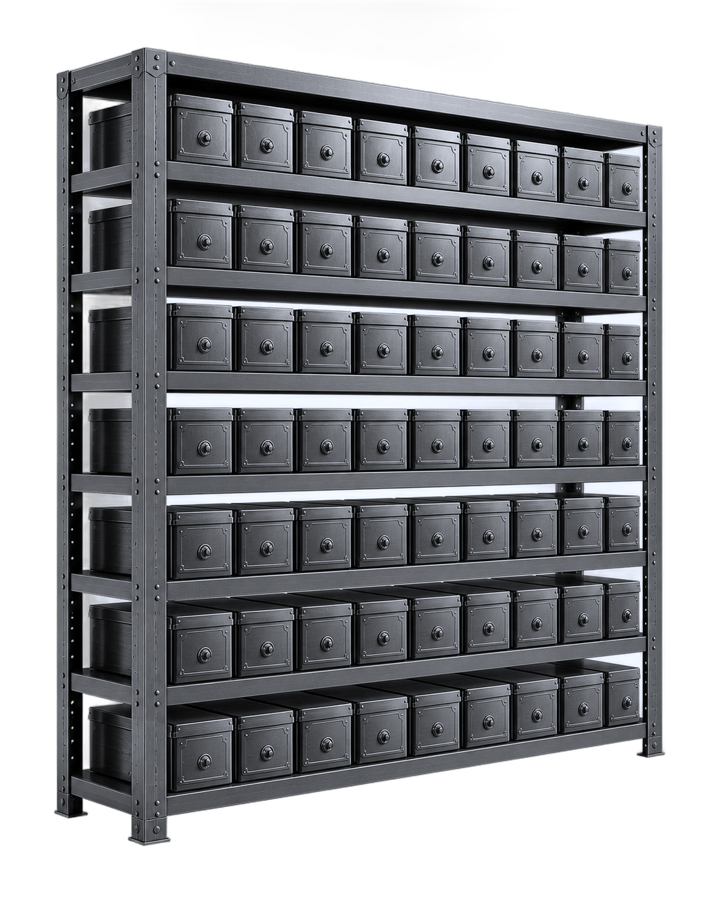

# Vault Network — home page build spec

Everything needed to rebuild `site-04/index.html` from an empty file. Values are
the ones in the shipped page, not approximations.

Two things to read first:

- **Nothing here is a mockup.** Every number below is load-bearing: the token
  names are what the palette switcher writes to, the animation eases are shared
  across the page, and the 3D model's dimensions are what its framing maths
  reads. Changing one without the other is where this page broke most often.
- **Section 12 is the list of traps.** Every entry there is a bug that shipped
  and had to be found. Read it before writing code, not after.

---

## 1. Dependencies

```html
<link rel="preconnect" href="https://fonts.googleapis.com">
<link rel="preconnect" href="https://fonts.gstatic.com" crossorigin>
<link href="https://fonts.googleapis.com/css2?family=Archivo:wght@300;400;500;600;800;900&family=JetBrains+Mono:wght@400;500&display=swap" rel="stylesheet">
```

```html
<script src="https://cdnjs.cloudflare.com/ajax/libs/gsap/3.12.5/gsap.min.js"></script>
<script src="https://cdnjs.cloudflare.com/ajax/libs/gsap/3.12.5/ScrollTrigger.min.js"></script>
<script src="https://cdnjs.cloudflare.com/ajax/libs/gsap/3.12.5/CustomEase.min.js"></script>
<script src="https://cdnjs.cloudflare.com/ajax/libs/three.js/r128/three.min.js"></script>
```

Every one of the four must be optional. The page renders, the menu opens and the
headline fits with all of them missing; only the motion and the model are lost.
Three.js is r128 specifically — `OrbitControls` is not in it and is not used,
and `CapsuleGeometry` does not exist there.

### Assets

```
vaults/vault-t1-steel.png       1500 × 1499, transparent
vaults/vault-t2-obsidian.png    1500 × 1499, transparent
vaults/vault-t3-quantum.png     1500 × 1500, transparent
vaults/vault-t4-origin.png      1500 × 1501, transparent
vaults/scene/archive-shelf.png  1122 × 1402   (hero still, only a fallback)
```

Each `` carries `data-fallback` with an inlined WebP copy of *itself*
(620px wide, quality 72, 24–36 KB each) plus `referrerpolicy="no-referrer"`. A
loader swaps to it on error. Pointing the fallback at a remote host instead is
how the page once served older renders while looking like nothing was wrong.

---

## 2. Tokens

```css
:root{
  --font-display:"Archivo",system-ui,-apple-system,"Segoe UI",sans-serif;
  --font-mono:"JetBrains Mono",ui-monospace,monospace;
  --ink:#0A0A0B;      /* page ground        */
  --steel:#141518;    /* raised surface     */
  --raise:#1A1C20;    /* card surface       */
  --paper:#E8E6E1;    /* text               */
  --dim:#8B8A86;      /* muted text         */
  --line:rgba(232,230,225,.14);
  --soft:rgba(232,230,225,.07);
  --signal:#FF4D14;   /* the one accent     */
  --r:0px;            /* panel radius       */
  --pad:clamp(16px,4vw,64px);
  --ease:cubic-bezier(.16,1,.3,1);
}
```

Every colour in the page comes from these. No literal hex outside `:root`
except `#0A0A0B` as the text colour on accent fills, and `#000` behind the hero
canvas.

Contrast, measured: `--dim` on `--ink` 5.73:1, `--dim` on `--raise` 4.94:1,
`--signal` on `--ink` 5.96:1, `--signal` on `--raise` 5.14:1. All above 4.5:1,
which is why small muted text over cards is legible.

### Global rules

```css
*{box-sizing:border-box;margin:0;padding:0}
body{background:var(--ink);color:var(--paper);font-family:var(--font-display);
  font-size:16px;line-height:1.55;-webkit-font-smoothing:antialiased;
  -moz-osx-font-smoothing:grayscale;overflow-x:hidden}
::selection{background:var(--signal);color:#0A0A0B}
:focus-visible{outline:2px solid var(--signal);outline-offset:3px}
[id],.btn,.pill{scroll-margin-top:96px}   /* the fixed bar must not cover the target */

.wrap{max-width:1560px;margin:0 auto;padding-inline:var(--pad)}
.mono{font-family:var(--font-mono);font-size:11px;letter-spacing:.16em;
  text-transform:uppercase;color:var(--dim)}
.h-sec{font-weight:900;text-transform:uppercase;line-height:.9;
  letter-spacing:-.035em;font-size:clamp(30px,4.4vw,68px)}
.note{margin-top:22px;color:var(--dim);max-width:60ch}
h2,h3,.h-sec{text-wrap:balance}
```

`.wrap` is the page measure. **Every** top-level container uses it, and the hero
matches it by hand (§4). One section carrying its own inset is the whole
alignment bug in §12.

`.note` must not be scoped to a section. Scoping it to `.band` left the leads in
`.part` and `.closer` with no gap and no muted colour.

### Buttons

```css
.btn{cursor:pointer;min-height:44px;display:inline-flex;align-items:center;
  justify-content:center;white-space:nowrap;border-radius:999px;font-weight:600;
  font-size:13px;padding:14px 24px;border:1px solid transparent;
  transition:background .22s ease,color .22s ease,border-color .22s ease,transform .22s ease}
.btn:hover{transform:translateY(-1px)}
.btn:active{transform:translateY(0)}
.btn-solid{background:var(--paper);color:var(--ink)}
.btn-solid:hover{background:#ffffff}
.btn-line{border-color:rgba(232,230,225,.35);color:var(--paper)}
.btn-line:hover{border-color:var(--paper);background:var(--soft)}
```

No magnetic cursor-following and no 3D tilt on controls. Both were built and
both were removed: a button that moves away from the pointer reads as broken.

---

## 3. Navigation

Fixed bar, `z-index:50`, `pointer-events:none` on the bar with `auto` on its
children so the hero underneath stays draggable.

Left: the brand lockup — the client's SVG (viewBox `0 0 538 134`, a white tile
with an orange asterisk and a two-line wordmark), **inlined** into the markup so
a page opened on its own still shows it, at `height:36px` (30px under 420px).
The bar's height comes from the 44px `Menu` pill, so the lockup never grows it.
Then the `Menu` pill, whose two bars cross into an X via a class swap. Right: `Your vaults`
(outline) and `Get a Vault` (solid). Both right-hand actions fade to
`opacity:0;pointer-events:none` while the overlay is open.

```css
.nav{position:fixed;inset:0 0 auto 0;z-index:50;pointer-events:none;
  display:flex;align-items:center;justify-content:space-between;gap:16px;padding:16px}
.nav > *{pointer-events:auto}
@media(min-width:768px){.nav{padding:24px 32px}}
```

### Overlay menu

```html
<div class="ov" id="ov" aria-hidden="true">
  <div class="block"></div>   <!-- ×8 -->
</div>
<div class="ov-menu" id="ovMenu" role="dialog" aria-modal="true"
     aria-label="Main menu" aria-hidden="true" tabindex="-1">
  <p class="ov-title">[ index ]</p>
  <div class="ov-list"> … </div>
</div>
```

```css
.ov{position:fixed;inset:0;z-index:40;display:flex;pointer-events:none}
.ov .block{flex:1;height:100%;background:var(--ink);margin-right:-2px;
  clip-path:polygon(0 0, 100% 0, 100% 0, 0 0)}
.ov-menu{position:fixed;inset:0;z-index:41; /* centred column */ }
body.ov-open .ov,body.ov-open .ov-menu{pointer-events:auto}
```

Seven entries: `001 Home`, `002 Vaults`, `003 How it works` → `index.html#how`,
`004 Partners`, `005 FAQ`, `006 About`, `007 Your vaults`. Each row is
`1 / 3 / 1` — number, name centred at `clamp(26px,4vw,72px)`, `[ open ]` right.

One paused timeline, played forward to open and **reversed** to close:

```js
tl.to(".ov .block",{clipPath:"polygon(0% 0%, 100% 0%, 100% 100%, 0% 100%)",
  duration:1, stagger:.075, ease:"power3.inOut"});
tl.to(".ov-title, .ov-item",{opacity:1, duration:.3, stagger:.05}, "-=0.5");
if(reduce) tl.timeScale(60);
```

The `-=0.5` is the point of the effect: the index fades in while the last
columns are still travelling. Building two timelines instead of reversing one is
how open and close drift apart.

Required behaviour: Escape closes, backdrop closes, focus is trapped in the
dialog while open, `body` scroll is locked, focus returns to the button on
close. The blocks must not swallow clicks while closed — hence the
`pointer-events` toggle rather than relying on the clip alone.

The overlay must work **without GSAP**: fall back to setting `clip-path` and
`opacity` directly. And it must not borrow helpers from the motion script — that
script returns early when GSAP is absent, so anything it defines is unavailable.

---

## 4. Hero

```html
<section class="hero">
  <div class="hero-media">
    <div class="hero-model" id="heroModel">
      
    </div>
    <!-- veil, pointer-events:none -->
  </div>
  <div></div>                       <!-- spacer for space-between -->
  <div class="hero-foot" id="heroFoot">
    <div class="hero-left">
      <p class="hero-sub" id="heroSub"><i></i>Forgotten network. Sealed archive.</p>
      <h1>
        <span class="ln"><i class="light">Some things are meant</i></span>
        <span class="ln"><i class="heavy">to be <em>opened</em>.</i></span>
      </h1>
      <div class="hero-cta" id="heroCta">
        <a class="btn btn-solid" href="vaults.html">Get a Vault</a>
        <a class="btn btn-line" href="partners.html">Become a partner</a>
      </div>
    </div>
  </div>
</section>
```

```css
.hero{position:relative;min-height:100svh;display:flex;flex-direction:column;
  justify-content:space-between;overflow:hidden}
.hero-media{position:absolute;inset:0;z-index:0;background:#000}
.hero-media::after{content:"";position:absolute;inset:0;pointer-events:none;
  background:radial-gradient(130% 90% at 50% 34%,rgba(10,10,11,0),rgba(10,10,11,.34) 78%)}
.hero-foot{position:relative;z-index:30;width:100%;max-width:1560px;margin-inline:auto;
  padding:clamp(28px,6vh,72px) var(--pad) clamp(24px,5vh,56px);
  background:linear-gradient(to top,var(--ink) 0%,rgba(10,10,11,.82) 50%,transparent 100%)}
.hero-sub{display:flex;align-items:center;gap:10px;font-size:13px;color:rgba(232,230,225,.55)}
.hero-sub i{width:8px;height:8px;border-radius:999px;background:var(--signal)}
.hero h1{margin-top:18px;font-size:clamp(1.4rem,7.2vw,4.2rem);letter-spacing:-.03em;
  line-height:1.02;text-wrap:nowrap}
.hero h1 .ln{display:block;overflow:hidden;padding-bottom:.06em;white-space:nowrap}
.hero h1 .ln i{display:block;font-style:normal;transform:translateY(104%)}
.hero h1 .light{font-weight:300;color:rgba(232,230,225,.82)}
.hero h1 .heavy{font-weight:900;text-transform:uppercase;letter-spacing:-.045em}
.hero h1 em{font-style:normal;color:var(--signal)}
```

`max-width:1560px;margin-inline:auto` on `.hero-foot` is not decoration: without
it the hero copy sits one gutter from the viewport while every section below
starts from the 1560px column, and the left edge jumps 180px at 1920 and 500px
at 2560.

The veil is thin on purpose. It was tuned for a photograph; a line drawing
disappears under the darkening a photograph needs.

### Headline fit — required, not optional

The two lines are `nowrap`, so they cannot reflow, so they must be measured and
scaled. In its own IIFE, independent of GSAP:

```js
function room(el){                       // the parent's CONTENT box
  var cs = getComputedStyle(el);
  return el.clientWidth - parseFloat(cs.paddingLeft||0) - parseFloat(cs.paddingRight||0);
}
function fitHero(){
  var box = room(h1.parentElement);
  if(box <= 0) return;
  h1.style.fontSize = "100px";
  var widest = 0;
  lines.forEach(function(el){ widest = Math.max(widest, el.scrollWidth); });
  h1.style.fontSize = widest > 0
    ? Math.max(24, Math.min(100 * (box / widest), 104)) + "px" : "";
}
```

Two details decide whether this works at all:

- **`scrollWidth`, not `getBoundingClientRect().width`.** The lines are block
  elements; their box is the column, not the text. Measuring the box makes every
  ratio 1 and pins the headline near its maximum at any viewport.
- **The parent's content box, not `clientWidth`.** `clientWidth` includes the
  parent's padding, and sizing to it overflows by both gutters.

Re-run on: load, `ResizeObserver` on the parent, `orientationchange`,
`document.fonts.ready`, and `fonts.loadingdone`. Coalesce into
`requestAnimationFrame` — a guard flag that drops events mid-fit leaves the size
stale while the window is being dragged.

Resulting sizes: 27px at 375, 58px at 768, 55px at 1440 and 1920.

### Entrance

```js
gsap.from("#heroModel",{opacity:0, duration:1.6, ease:EASE});
gsap.from("#heroFoot", {y:20, opacity:0, duration:1,  ease:EASE, delay:.5});
gsap.from("#heroSub",  {y:16, opacity:0, duration:.8, ease:EASE, delay:.6});
gsap.to(".hero h1 .ln i",{y:0, duration:1.1, ease:EASE, delay:.8, stagger:.1});
gsap.from("#heroCta",  {y:16, opacity:0, duration:.8, ease:EASE, delay:1});
```

`EASE` is `CustomEase.create("ref","M0,0 C0.16,1 0.3,1 1,1")` with `"expo.out"`
as the fallback when the plugin is absent. Do not scale the canvas on scroll —
it stretches pixels; the model reacts to scroll itself (§5).

---

## 5. The 3D model

Sixty-three sealed containers, drawn as lines. No rack: the frame was built and
then removed, because without it the safes read as the archive rather than as
furniture. Their positions are unchanged.

```js
BAYS = 9;  LEVELS = 7;
BOX_W = 240; BOX_H = 250; BOX_D = 420; BOX_GAP = 14;
POST = 60; PITCH = 330; BASE = 130; SHELF_T = 24; OVERHANG = 45;
S = 0.001;                                  // millimetres to scene units
```

Shelf heights are still needed — they are where the containers sit:
`shelfY[l] = BASE + l * PITCH`, and a container's centre is
`shelfY[l] + SHELF_T/2 + BOX_H/2`. Row starts at `-innerW/2 + BOX_W/2` where
`innerW = BAYS*BOX_W + (BAYS-1)*BOX_GAP`.

Per container: box edges, an inset front rectangle (`BOX_W-46 × BOX_H-46`), and
a dial at `BOX_D/2 + 1` — two circles (r 42 seg 22, r 16 seg 14) and two ticks.

**Four buffers, not 63 objects.** Push every vertex into shared arrays and draw
with `THREE.LineSegments`: containers in `--paper` at 0.26 opacity, dials in
`--signal` at 0.75. Sixty-three objects would be sixty-three draw calls a frame.

Colours are read from the page with `getComputedStyle` on `--foreground` /
`--brass` (or `--paper` / `--signal`), so the palette switcher repaints the
model.

### Framing

Measure the bounding box of what was actually drawn, hang its centre on a pivot,
and derive the distance:

```js
radius   = sqrt(max(spanX,spanZ)² + spanY²) / 2 * S;   // the sphere it sweeps
fitDist  = radius / sin(min(vFov,hFov)/2) * 1.06 / 1.35;
```

`1.06` is the margin; `/1.35` is the 35% enlargement, applied by moving the
camera in rather than by scaling the model. Recompute on resize and keep the
user's zoom ratio.

### Interaction

Hover turns it within ±0.5 rad yaw and ±0.2 pitch; drag spins freely with
inertia (`v *= 0.92`), pitch clamped to ±0.8; double click resets to
`yaw -0.62, pitch -0.14`; auto-rotate at `0.0016`/frame after 120 idle frames.
No wheel handler — the wheel scrolls the page.

`touch-action: pan-y` on the canvas. `none` means a finger cannot scroll past a
full-screen model.

### Scatter on scroll

Each container keeps its seat so it can be pushed out and put back:

```js
dx = (bay   - (BAYS-1)/2)   * 190 * k;
dy = (level - (LEVELS-1)/2) * 120 * k;
dz = (260 + abs(bay - (BAYS-1)/2) * 90) * k;
```

`k` is the hero's own travel, `clamp(-rect.top / rect.height, 0, 1)`, not
document scroll: the field is fully apart exactly as the hero leaves. Write into
the buffer attributes and set `needsUpdate`; ease `k` toward its target at 0.12
per frame.

### Lifecycle

Stop drawing when off screen (`IntersectionObserver`). On teardown: cancel the
frame, disconnect observers, remove every listener, dispose geometries,
materials and the renderer, and detach the canvas.

---

## 6. Sections, in order

Section order and the exact copy. `kicker` is `.mono` above the heading.

### Manifest
`.manifest` — rules top and bottom, `padding:clamp(52px,8vh,96px) 0`. Two
columns, `auto 1fr`: kicker `The network remains`, then at
`clamp(20px,2.6vw,38px)` weight 300: **The seal holds until you decide it
shouldn't.**

### Origin `#origin`
`.origin-grid` is `1.15fr .85fr`, gap `clamp(32px,6vw,110px)`. Left: kicker
`Origin`, `.h-sec` **Nothing here opens by accident.** Right: two paragraphs.

Below, `.stat-row` — three equal columns, top rule, **no vertical dividers**:

| | |
|---|---|
| `4` | Tiers in the register |
| `1` | Unlock per vault, ever |
| `0%` | Vaults reissued after unlock |

Markup is `<b data-count="4">0</b>` with `data-suffix="%"` on the third. Numbers
count up on entry; `font-variant-numeric: tabular-nums` or the width jumps as
they run.

### The collection `#register`
`.shaft-head` carries `padding-block` — **never** the `padding` shorthand, it
also carries `.wrap`. Kicker `The collection`, `.h-sec` **Four tiers. Four
distinct Vaults.**, then the lead:

> Each tier represents a different class of Vault — individually identified,
> sealed, and held until its owner decides what happens next. Partner platforms
> build the worlds where Vaults are honoured, and each world sets its own terms.

Then a sticky stack of four cards:

```css
.stack-card{position:sticky;top:0;min-height:100svh;display:flex;align-items:center}
.card-inner{width:100%;max-width:1560px;margin:0 auto;padding-inline:var(--pad)}
.card-face{background:linear-gradient(160deg,var(--raise),var(--steel));
  border:1px solid var(--line);overflow:hidden;display:grid;
  grid-template-columns:minmax(0,1fr) minmax(0,.95fr);align-items:center;
  min-height:clamp(420px,68vh,660px)}
```

Pinning, from GSAP, with the previous card receding:

```js
cards.forEach(function(card,i){
  if(i === cards.length-1) return;                       // the last is not pinned
  ScrollTrigger.create({trigger:card, start:"top top",
    endTrigger:cards[cards.length-1], end:"top top",
    pin:true, pinSpacing:false, refreshPriority:1});
  gsap.to(card.querySelector(".card-face"),{scale:.93, autoAlpha:0, ease:"none",
    scrollTrigger:{trigger:cards[i+1], start:"top bottom", end:"top top", scrub:true}});
});
```

`autoAlpha:0`, not `opacity:.34`. A card left at 34% is still drawn and shows
past the edges of the one in front. `refreshPriority:1` puts the pins first in
the refresh order, or everything below them is measured against the wrong
offsets.

Card content per tier — entry number, `Tier N — Rarity`, name, price with
`per vault`, the held-inside line, the blurb, and three specs
(Construction / Issue / Status: `Seal intact`):

| Entry | Tier | Name | Price | Construction | Issue |
|---|---|---|---|---|---|
| 001 | I — Common | Steel Vault | $10 | Rolled steel, single-wall | Production line |
| 002 | II — Uncommon | Obsidian Vault | $50 | Layered composite | Limited run |
| 003 | III — Elite | Quantum Vault | $100 | Contained field housing | Restricted issue |
| 004 | IV — Legendary | Origin Vault | $500 | Prototype, hand-finished | First production run |

Inside the **fourth** card only, after `</article>`:

```css
.stack-tail{margin-top:calc(clamp(22px,3.4vh,40px) + 120px)}
```

> Every Vault is serialised on issue. Nothing repeats, and nothing carries a
> batch price. What a Vault opens onto is set by the world that honours it.

plus `Open the full register` (outline). It lives inside the card because that
card already reserves a screen; a separate block after the stack leaves the
screen blank above it. Shrinking the last card instead is the trap in §12.

### How it works `#sequence`
An empty `<span id="how">` sits immediately before the section — the navigation
links to `#how`. `.seq-grid` is `.8fr 1.2fr`. Left is sticky at `top:120px`:
kicker `How it works`, `.h-sec` **Keep it sealed.<br>Or don't.**, lead
`Every Vault starts sealed. What happens next is up to its holder.`

Right, three `.step` blocks separated by top rules, each with a `.tag-line` in
`--signal`, an `h3` and a paragraph: `Acquire` / One purchase, one delivery,
`Hold or trade` / Sealed doesn't mean static, `Unlock` / The only irreversible
step.

Then `.notes`, rows of `250px 1fr`: Trade while sealed, Supply changes with
every unlock, Ownership stays flexible. Closing line: *Trade is not a required
step. A Vault can be held, moved, or opened — in any order the holder chooses.*

### The purchase flow
`.band`. Kicker `The purchase flow`, `.h-sec` **Checkout that feels familiar.**,
`.note` `Familiar for anyone who has used a payment gateway.`

`.preview` is `minmax(0,.4fr) minmax(0,1fr)`. The left column holds, in one
wrapper: the seven-step list (`01 Select Vault` … `07 Success`), then
`.fineprint` stacked in a column — *All sales are final and non-refundable* and
*Purchase is subject to the [Terms of Service](terms.html)* — then, at
`margin-top:100px`, `Open the checkout demo`. All three in the same column so
that 100px is measured from the terms line rather than from whichever column
happens to be taller.

Right column: a browser frame — bar with three squares and
`thevaultnetwork.world`, a head with `Vault Network` and a `Create Wallet` chip,
then `Vault selection` and four tier cards (`T1`…`T4`, rarity, render, name,
price with cents). Tier 3 is selected: `border-color:var(--signal)` and
`background:rgba(255,77,20,.06)`. Below, `Amount` and `$150.00` — which is the
basket 5 × $10 + 1 × $100, not a figure typed in — and a non-interactive
`Proceed` bar.

`.co-btn` must centre with flex. It was written for a `<button>`, where the user
agent centres the label; on a `<div>` the text sits top-left.

### For partners `#partners`
`.part`. Kicker `For partners`, `.h-sec` **Designed to fit your platform.**,
`.note` with the infrastructure line. `.bento` is `1.25fr 1fr`, `gap:1px` over a
`--line` background so the gap draws the grid. First cell spans three rows and
holds `vault-t2-obsidian.png` at `min(78%,420px)`; the other three are
Asset infrastructure, Unlock events, Checkout flexibility.

The render tilts on pointer move — `rotationX/Y` up to 9°, `perspective:900px`
on the cell, `transform-style:preserve-3d` on the image. The listeners are on
the **image**, not the cell: on the cell the whole panel and the text beside it
rotate with it. Reset on leaving both the image and the cell, or a fast exit
leaves it tilted.

### Money flow
`.band alt` (`background:var(--steel)`). Kicker `Money flow`, `.h-sec` **What
the holder sees, what the Network does.** A four-row table, columns Stage /
Actor / What happens: Payment initiation · User, Fiat processing · Checkout
processing, Execution · Asset creation, Vault delivery · User wallet. Under
760px the table becomes blocks and the head is hidden.

### Get started
`.closer`. Kicker `Get started`, then the masked two-line headline
**Bring Vaults to / your _platform_.** (accent on the last word), the note about
onboarding, and two buttons: `Become a partner` (solid), `View the archive`
(outline).

---

## 7. Motion layer

`gsap.registerPlugin(ScrollTrigger)`; `CustomEase` if present.

```js
function splitWords(el){ /* wrap each word in .sw > .swi, set aria-label on el,
                            aria-hidden on the shards */ }

function revealHeading(el){                        // headings only
  var words = splitWords(el);
  gsap.set(words,{yPercent:118, rotate:1.6});
  gsap.to(words,{yPercent:0, rotate:0, duration:1, ease:EASE, stagger:.045,
    scrollTrigger:{trigger:el, start:"top 88%"}});
}

function revealText(el){                           // prose: block fade, no splitting
  gsap.fromTo(el,{opacity:0, y:16},{opacity:1, y:0, duration:.55, ease:"power2.out",
    scrollTrigger:{trigger:el, start:"top 90%", toggleActions:"play none none reverse"}});
}

function drawLine(el){                             // hairline under list rows
  var hl = document.createElement("i"); hl.className = "hairline"; el.appendChild(hl);
  gsap.to(hl,{scaleX:1, duration:1.1, ease:"power3.inOut",
    scrollTrigger:{trigger:el, start:"top 92%"}});
}
```

```css
.sw{display:inline-block;overflow:hidden;vertical-align:bottom;
  padding-bottom:.12em;margin-bottom:-.12em}
.swi{display:inline-block}                  /* no will-change here */
.hairline{position:absolute;left:0;top:-1px;height:1px;width:100%;
  background:currentColor;opacity:.24;transform:scaleX(0);
  transform-origin:left center;pointer-events:none}
```

Wiring:

```js
[".manifest p",".h-sec",".card-face h3",".step h3",".cell h3"].forEach(revealHeading…);
[".origin p",".shaft-head p",".card-text > p",".step p",".cell p",".seq-sticky p"]
  .forEach(revealText…);
qsa(".spec, .stat, .row").forEach(drawLine);
qsa("[data-count]")…                                   // counters
qsa(".mono").filter(el => !el.closest(".hero") && !el.closest(".nav")
                       && !el.closest(".ov-menu"))…    // label reveal
```

Rules that were learned the hard way:

- **Split headings, never prose.** Word-per-span on long paragraphs is hundreds
  of DOM nodes and a choppy screen-reader read. Set `aria-label` on the split
  heading and `aria-hidden` on the shards so assistive tech reads a sentence.
- **Never animate a layout property.** The mono labels once animated
  `letter-spacing`, which reflows every frame; it is `autoAlpha` + `x` now.
- **No blanket `will-change`.** It was on every split word — hundreds of layers
  promoted for good. Keep it only on genuinely continuous transforms.
- **One stagger beats N tweens** with hand-written delays on the same trigger.
- **`immediateRender:false`** on any late `from`/`fromTo` that shares a property
  with another tween, or the scrub records a start value mid-animation.
- **Exclude the overlay from page-wide selectors.** `.ov-title` once carried
  `.mono`, and the page-wide label reveal set it to `opacity:1` — a `[ index ]`
  floating over a closed menu.
- **A reveal on an element the page does not have** logs a GSAP warning per
  tween. Guard home-only blocks with `has(".hero")`, `has(".closer")`.
- `prefers-reduced-motion`: set final states and return.

---

## 8. Footer

One row, one rule, one line. `footer{border-top:1px solid var(--line);
padding:clamp(40px,6vh,72px) 0 clamp(28px,4vh,44px)}`.

- **Row** — the lockup (inlined, `height:clamp(30px,2.6vw,38px)`) on the left; on
  the right the main menu in a single line: How it works → `index.html#how`,
  Vaults, Partners, About, FAQ, Checkout demo. Mono, 11px, `.16em` tracking,
  uppercase, `--dim`, `--paper` on hover.
- **Rule** — `.f-rule`.
- **Legal** — *Softcursion OÜ, registration number 17542975. Tallinn, Estonia.
  © 2026 Softcursion OÜ. All rights reserved.* on the left, 12.5px `--dim`;
  Terms of Service and Privacy Policy on the right, same mono style as the menu.

Under 700px both rows stack. Nothing else: the statement block, the email
form, the four link columns, the contact block and the facts row were removed.

## 9. Palette switcher

Fixed bottom right, `z-index:95`. A 44px button opens a panel with four
typefaces and four palettes. Applying a palette writes the tokens onto
`documentElement.style`, so nothing else needs to know it exists.

| | ink | steel | raise | paper | dim | signal |
|---|---|---|---|---|---|---|
| Machine | `#0A0A0B` | `#141518` | `#1A1C20` | `#E8E6E1` | `#8B8A86` | `#FF4D14` |
| Cold Steel | `#07080A` | `#0E1014` | `#151A22` | `#EFECE6` | `#8A8F97` | `#C6B78F` |
| Cobalt | `#0B0B0D` | `#17181C` | `#1E2027` | `#F1EFEA` | `#8B8B84` | `#7C90FF` |
| Ember | `#0C0A09` | `#191513` | `#231B17` | `#EFE9E2` | `#948880` | `#E0A24A` |

`--line` and `--soft` move with each palette (paper at 13–14% and 6–7%). Lowest
contrast across all four is 4.74:1.

Typefaces: Industrial (Archivo / JetBrains Mono), Technical (Geist / Geist
Mono), Editorial (Bricolage Grotesque / Space Mono), Sculpted (Syne / DM Mono).
Each family is fetched lazily — on hover and on first panel open, not on load —
and applied by rewriting `--font-display` and `--font-mono`.

After a typeface change, re-run the headline fit **and** `ScrollTrigger.refresh()`:
new metrics mean new heights, and stale heights break the pinning.

---

## 10. Responsive

| Breakpoint | What changes |
|---|---|
| 1024 | `.origin-grid`, `.seq-grid`, `.part-grid` collapse to one column |
| 900 | Stack cards go `position:static`, `min-height:auto`; card faces to one column; `.preview` to one column |
| 860 | `.stat-row` and `.bento` to one column; dividers become top rules |
| 768 | Nav padding 16px → 24/32px; `Your vaults` hidden below it |
| 760 | The flow table becomes blocks, its head hidden |
| 700 | Overlay entry name to `clamp(22px,7vw,40px)`; number and `[ open ]` stop flexing |
| 520 | Footer field and button stack |

---

## 11. Accessibility

- Heading order never skips: `h1` → `h2` → `h3`.
- `alt` on every image; decorative SVG gets `aria-hidden="true"`.
- Touch targets ≥ 44px; `cursor:pointer` on anything clickable.
- `scroll-margin-top:96px` on anchors so the fixed bar does not cover them.
- Overlay: `role="dialog"`, `aria-modal`, `aria-hidden` when closed, focus
  trapped, focus returned on close.
- Split headings keep `aria-label`; shards are `aria-hidden`.
- Focus visible everywhere: `2px solid var(--signal)`, offset 3px.
- Row highlights on `:hover` and `:focus-visible` only. `:focus-within` fires on
  a programmatic focus and made the first overlay row look pre-selected.

---

## 12. Traps

Every one of these shipped and had to be found.

1. **`padding` shorthand on an element that also carries `.wrap`.** Resets
   `padding-inline` to 0 and slides the section one gutter left. Use
   `padding-block`.
2. **`.hero-foot` without the 1560px cap.** Left edge diverges from the rest of
   the page by 180px at 1920, 500px at 2560.
3. **Measuring a block element's box for text width.** Block width is the
   column. Use `scrollWidth` under `nowrap`.
4. **`clientWidth` as available width.** Includes the parent's padding;
   overflows by both gutters.
5. **A busy flag around the fit.** Drops resizes that arrive mid-fit. Coalesce
   into `requestAnimationFrame`.
6. **The fit living inside the motion script.** That script returns early
   without GSAP, and a `nowrap` headline with no fit overflows. Separate IIFE.
7. **A short sticky last card.** It still sticks, stops providing scroll
   distance, and the pinned cards slide under it. Keep the height; move the
   trailing content inside the card.
8. **`opacity:.34` on the receding card.** Still drawn, and its edges show past
   the card in front once heights differ. `autoAlpha:0`.
9. **Pins created after the triggers below them.** Set `refreshPriority:1`.
10. **A gradient veil over the canvas.** Swallows every pointer event; the model
    cannot be dragged. `pointer-events:none`.
11. **`touch-action:none` on a full-screen canvas.** The page cannot be scrolled
    by touch. `pan-y`.
12. **`setSize(w,h,false)` with `setPixelRatio(2)`.** The canvas keeps no CSS
    size and lays out at twice the viewport; the drawing lands in the corner at
    double scale.
13. **Projecting a label through the wrong matrix.** Points inside the model are
    in its own space — use the model's `matrixWorld`, not the pivot's.
14. **`??` against an empty string.** An empty value is a value and wins. Treat
    blank as unset.
15. **A remote image fallback.** Serves whatever that host has now, which is how
    replaced renders kept appearing. Inline a copy of the current asset.
16. **Colour-only hover on a divider-less stat row.** Vertical dividers between
    the three figures read as separators the design does not want; the row has a
    top rule only.
